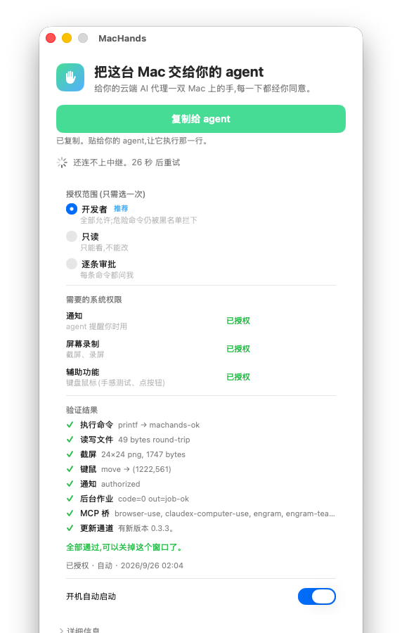

> **本分支是免费 Mac App Store 版，禁止合入 `master`。**
> 它和 MIT 开源 agent 桥是两个产品。说明见 [`APPSTORE.md`](APPSTORE.md)。

[English](README.md) | 中文

# MacHands

给你的云端 AI 代理一双 Mac 上的手，每一下都经你同意。

**完全免费 · [MIT](LICENSE) 开源 · 没有付费档 · 不用买许可证**

- **官网：** <https://machands.pages.dev>
- **源码：** <https://github.com/UnstoppableCurry/MacHands>

本仓库是 **agent 桥**：菜单栏里的 Mac App，加上 CLI / MCP。不是 DataDance，不是 MacDisk，也不是外置磁盘管理工具。

---

## 这是什么

Claude Code、Codex、Cursor 跑在云端时，碰不到你这台机器上的 Xcode、模拟器、Safari、公证。MacHands 让它们用你自己的 Mac 干活——不用租云端 Mac，不用开「远程登录」，也不用懂 SSH。

每一条命令都经你同意。危险操作有黑名单；你可以随时暂停或撤销授权。

## 截图与演示



一次性授权窗口。范围、系统权限和自检都在这一页完成。窗口里的「连不上中继、稍后重试」是连**自建中继**时的状态，不是公共中继地址。本仓库不发布默认中继 URL。

<video src="docs/media/authorize.mp4" controls muted playsinline width="572">
<a href="docs/media/authorize.mp4">authorize.mp4</a>
</video>

约 9 秒，同一扇授权窗口。账号邮箱已裁掉。

## 怎么拿到

这个仓库就是入口。**v0.3.1 只是源码发布**，没有附带已签名的 Mac 安装包。

| 你要什么 | 怎么拿 |
|---|---|
| **MacHands.app** | 在 Mac 上从源码构建（见下方）。请不要去找不存在的签名安装包。 |
| **CLI / MCP** | 在 agent 那台机器上：`npx -y machands`（npm 包名 [`machands`](https://www.npmjs.com/package/machands)） |

不上 Mac App Store：沙盒禁止执行任意命令、注入键鼠、截其他 App 的屏，而这些正是 MacHands 要做的事。

## 三步开始

1. 自建中继（见下方），在 MacHands 里填入它打印的地址。
2. 打开 **MacHands.app**，菜单栏出现一只手。点 **复制给 agent**。
3. 把复制到的文字贴给你的云端 agent。它会自己执行里面那一行，几秒后菜单栏显示「已连接」。

配对成功后会弹出**授权页**，只做一次：选范围（**开发者** / **只读** / **逐条审批**）→ 勾三项系统权限（通知、屏幕录制、辅助功能）→ 点 **授权并验证**。7 项自检全绿就完了。

「逐条审批」时每张卡先说**代理要干什么**，原始命令收在「详情」里。`rm -rf /`、`sudo`、`diskutil erase` 这类命令在任何模式下都会被拦住。

## 它保证什么

- 不需要打开「远程登录」，没有 sshd 暴露。执行命令的是 App 本身。
- agent 与 Mac 之间端到端加密（X25519 + ChaCha20-Poly1305），中继只见密文。
- 每条命令与你的决定都写进 `~/Library/Logs/MacHands/audit.log`。
- 授权可撤销；配对码 10 分钟有效、只能用一次。

## 中继：只走自建

没有公共托管中继。你必须自己起一台，并把地址填进 App。

```bash
sudo sh relay/install.sh
```

也可以 `npm i -g machands && machands relay start --port 8443`。起来之后它会打印要填进 Mac 的 `ws://` / `wss://` 地址。说明见 [`relay/README.md`](relay/README.md)。

## 仓库结构

| 目录 | 内容 |
|---|---|
| [`SPEC.md`](SPEC.md) | 产品与协议契约（真源） |
| [`macapp/`](macapp/) | macOS 菜单栏 App（SwiftPM, AppKit），见 [`macapp/BUILD.md`](macapp/BUILD.md) |
| [`agent/`](agent/) | npm 包 `machands`：CLI + MCP 服务器，见 [`agent/README.md`](agent/README.md) |
| [`relay/`](relay/) | 中继服务（Node + ws），自建见 [`relay/README.md`](relay/README.md) |
| [`shared/`](shared/) | 加密互通测试向量，Node 与 Swift 两边都要通过 |
| [`tools/license/`](tools/license/) | 协议里的许可证令牌工具（产品本身免费，无需购买） |
| [`site/`](site/) | 官网静态样例，不是现成的签名包 |
| [`docs/RELEASE.md`](docs/RELEASE.md) | 维护者发布手册 |
| [`docs/media/`](docs/media/) | 真机授权窗口截图与短演示 |

## 构建与测试

```bash
node --test relay/test agent/test        # Linux / Mac 都行
cd macapp && swift build && swift test   # 需要 Mac + Xcode 命令行工具
cd macapp && ./scripts/build-app.sh      # 产出 MacHands.app
open dist/MacHands.app --args --no-relay # 只起界面、不连中继
machands verify                          # 装机后自检
```

签名发布需要你自己的 Developer ID，见 [`macapp/BUILD.md`](macapp/BUILD.md) 与 [`docs/RELEASE.md`](docs/RELEASE.md)。本仓库不提供现成安装包。

## 接入 agent

配对成功后 CLI 会打印这一段；也可以随时手抄：

```
Claude Code:  claude mcp add machands -- npx -y machands mcp
Codex:        ~/.codex/config.toml 加 [mcp_servers.machands] command="npx" args=["-y","machands","mcp"]
Cursor:       Settings → MCP → Add: npx -y machands mcp
命令行:       machands run -- xcodebuild -version
```

## 许可

源码以 [MIT](LICENSE) 开源。Copyright © 2026 UnstoppableCurry。

MacHands 不是 Apple、Anthropic、OpenAI 或 xAI 的产品。
